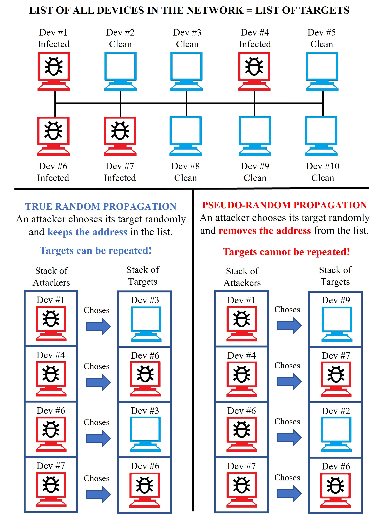

# Exact models of random propagation of malware

This repository contains the Matlab scripts used in Carnier et.all [1][2] to validate the proposed exact mathematical model of random propagation of malware (by random propagation we refer to the main sub-dynamics of a mathematical model of malware like SIS, SEIRS, etc).

Our model is proposed as a substitute to the standard nonlinear model found in >95% of the literature. Below we show the usage of both models inside the simplest compartmental malware model SIS.

## Proposed vs Standard models of random propagation

Both models are nonlinear, being used in numerical evaluations rather than closed-form solutions. As trade-off for the exactness of our model, it has only two more operations than the standard model.

In the equations below, $I_n$ is the number of new infections created this turn $T$, $S$ is the number of susceptible devices, $I$ is the number of infected devices, $\alpha$ is the rate of infection, $\beta$ is the rate of cleaning and $N$ is the total number ofdevices in the network.

### Exact Markov chain model of random propagation

$$I_{n/ex}[T] = S[T]\left(1 - \left( 1 - \dfrac{\alpha}{N} \right)^{I[T]} \right)$$

### Standard nonlinear model of random propagation 

$$I_{n/std}[T] = \alpha S[T] \dfrac{I[T]}{N}$$

### Usage of random propagation dynamics in the complete SIS model

$$S[T+1] - S[T] = - I_{n/std}[T] + \beta I[T]$$

$$I[T+1] - I[T] = I_{n/std}[T] - \beta I[T]$$

## Difference of behavior between proposed and literature model



# Usage of repository

The repository contains both scripts for evaluations of the mathematical model evaluation and the simulation results. The results of each are independent because of the different treatment of states of devices. The mathematical model is a compartmental model that does not keep track of individual states for devices and treat the rate of infection as parameter in the equations. The simulation does keep track of individual states for devices and performs random tests for every attempt of infection and detection.

### Scripts in main folder

1. Script that initializes all parameters used in the files of this repository (rate of infection, of detection, size of network, etc).

```bash
initParam;
```

2. Evaluation of Markov chains for different compartmental models. Just run the scripts below:

```bash
EvaluateMarkovChainSis;
EvaluateMarkovChainSeirs;
EvaluateMarkovChain2Seis;
EvaluateMarkovChainSii;
EvaluateMarkovChainSiq;
```

3. Simulation of the same malware models as above:

```bash
SimulateSisGlobal;
SimulateSeirsGlobal;
Simulate2SeisGlobal;
SimulateSisLocal;
```

### Folder +markovs

Folder with functions containing dynamics of each Markov chain modeled in the papers. Inputs are current system state, parameters and control variables of mitigation (G), output is next system state.

### Folder +infecmodels

Functions that perform the infection phase in the simulation and alter the state matrix in the simulation. Specific to each compartmental model.

### Folder +mitigmodels

Functions that perform the mitigation phase (cleaning of malware) in the simulation and alter the state matrix in the simulation. Specific to each compartmental model and topology of network.

### Folder +init and +simultools

Functions for manipulation of the simulation matrix containing the states of individual devices.

### Folder +metrics

Functions for calculation of the metrics of validation of Markov chains against simulations, used in paper [1].

### Folder +plots

Scripts for creating time-series figures for the evolution of compartmental populations (susceptible, infected, exposed, recovered, dead, etc). Plots also errors between the Markov chain of a specific model (SIS, SEIRS, etc) and its respective simulation.

### Data

Every evaluation of Markov chains and run of simulations saves a .mat file that is used by scripts in the folder +metrics.

## Funding

This research was conducted under a contract of “Research and development on IoT malware removal / make it non-functional technologies for effective use of the radio spectrum” among “Research and Development for Expansion of Radio Wave Resources (JPJ000254)”, which was supported by the Ministry of Internal Affairs and Communications, Japan.

## References

If this repository is used in your work in any capacity, please cite our work [1].

[1] Carnier, R.M.; Li, Y.; Fujimoto, Y.; Shikata, J.
"Exact Markov Chain of Random Propagation of Malware with Network-Level Mitigation,"
{\em IEEE Internet of Things Journal}, Vol.10, No.12, pp.10933-10947, June 2023, DOI: [10.1109/JIOT.2023.3240421](https://ieeexplore.ieee.org/document/10029367).

[2] Carnier, R.M.; Li, Y.; Fujimoto, Y.; Shikata, J.
"Modeling of Malware Propagation in IoT Network and Mitigation in Area based on Local Routing Depth,"
7th IEEJ International Workshop on Sensing, Actuation, Motion Control, and Optimization (SAMCON), pp.336-341, Tokyo, Japan, 2021, [paper pdf](https://www.researchgate.net/publication/350546539_Modeling_of_Malware_Propagation_in_IoT_Network_and_Mitigation_in_Area_based_on_Local_Routing_Depth).
